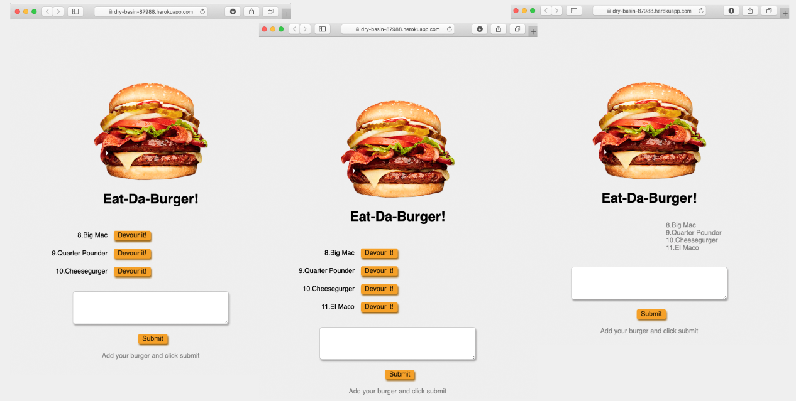

# Eat Da Burger!

  ## Description
  

  Add the burger you want to eat and devour it with the click of a button.

  Github repository :link: https://github.com/avpizarro/burger.git

  Heroku webpage :link: https://dry-basin-87988.herokuapp.com/

  

  ## Table of Contents

  * [Installation](#installation)
  * [Usage](#usage)
  * [License](#license)
  * [Questions](#questions)

  ## Installation
  Follow this :link: [Eat Da Burger!](https://dry-basin-87988.herokuapp.com/) to use the app. 

  ## Usage
  Add a description of the burger you want to eat and then click the submit button to add it tothe list. Click on the Devour it! button to eat your burger, the eaten burger will move to the list on the right.

  ## License
  This Source Code Form is subject to the terms of the MIT License. 
  If a copy of the License was not distributed with this file, You can obtain one at https://opensource.org/licenses

  ## Questions
  For further information please visit my GitHub page:
  https://github.com/avpizarro

  Or email me directly: avpizarro@live.com
  